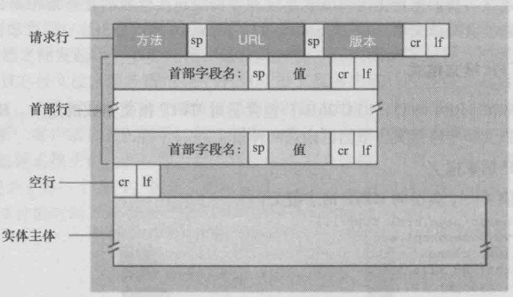
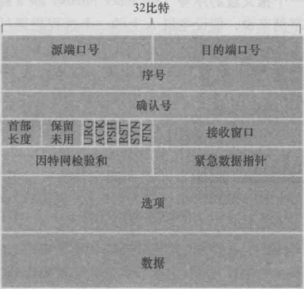
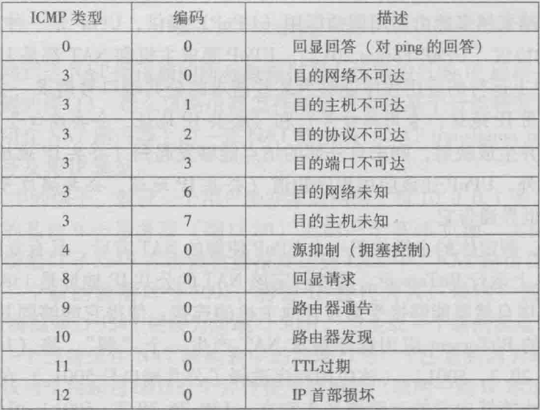
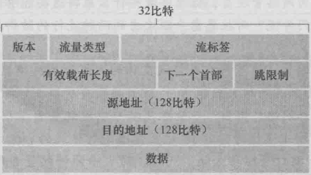

[TOC]

## 1 计算机网络和因特网

#### 1.1 什么是因特网

- 主机 host / 端系统 end system 通过通信链路 communication link 和分组交换机 packet switch 连接在一起
- 链路的传输速率 ­transmission rate: *bandwidth* bps
- 发送端将数据分段，加上首部后形成分组 packet，通过网络发送到目的段并装配成原始数据
- 从发送端到接收端，分组所经过的称为路径 path/route
- 端系统通过因特网服务提供商 Internet Service Provider ISP 接入因特网并获得服务
- 协议控制因特网中信息的收发，定义了通信实体间交换的报文格式和次序，以及接受/发送信息时采取的动作 / protocols define format, order of messages sent and received among network entities, and actions taken on message transmission, receipt 
  - 网际协议 Internet Protocol IP
  - 传输控制协议 Transmission Control Protocol TCP
- 请求评论 Request For Comment RFC

#### 1.2 网络边缘

- 端系统划分为客户 client和服务器 server
- 接入网 access network 指将端系统连接到边缘路由器 edge router 的物理链路，边缘路由器是端系统到其他远程端系统路径上的第一台路由器
- 数字用户线 Digital Subscriber Line DSL、DSL调制解调器、数字用户线接入复用器DSLAM、频分复用技术
- 电缆 cable、混合光纤同轴 Hybrid Fiber Coax HFC、电缆调制解调器 cable modem、电缆调制解调器端接系统 Cable Modem Termination System CMTS
- 局域网LAN

#### 1.3* 网络核心

##### 分组交换 packet switching

- 端系统交换报文 message，可以包含控制内容或数据
- 源端将长报文划分成分组 packet，通过通信链路和分组交换机（分组交换机有路由器 router 和链路层交换机 link-layer switch）传送
- 若源端系统或分组交换机经过一条链路发送L比特的分组，传输速率为R bps，则传输时间为L/R秒
- 储存转发传输 store-and-forward transmission
  - 分组交换机在接收并处理整个分组后才开始向输出链路传输该分组，先缓存再转发
- 排队时延和分组丢失
  - 对每条相连的链路，分组交换机具有一个输出缓存 output buffer / 输出队列 output queue，储存发往该链路的分组
  - 排队时延 queue delay
  - 分组丢失/丢包 packet lost
- 转发表和路由选择协议
  - 每台路由具有一个转发表 forwarding table，当分组到达时，根据路由表将目的地址或其部分映射成输出链 / forwarding: move packets from router’s input to appropriate router output
  - 路由选择协议 routing protocol 用于自动设置转发表 / routing: determines source-destination route taken by packets

##### 电路交换 circuit switching

- 电路交换网络中，端系统通信会话期间，预留了路径资源，即创建专用的端到端连接 end-to-end connection，而分组交换网络中，路径资源不预留，按需使用，因此可能发生等待

- 频分复用 Frequency-Division Multiplexing FDM 链路的频谱由所有连接共享，在连接期间每条连接专用一个频段
- 时分复用 Time-Division Multiplexing TDM 时间被划分为固定区间的帧，每帧被划分为固定数量的时隙，为每个连接在帧中指定时隙

- 电路交换因为在静默期 silent period 专用电路空闲而效率较低

- 对比而言，分组交换
  - 不适合实时服务，因为端到端时延可变且不可预测，excessive congestion possible
  - 提供给了更好的带宽共享，支持更高并发，allows more users to use network
  - 简单有效，实现成本低

##### 网络的网络

- 网络结构1 单一的全球承载ISP互联所有接入ISP access ISP，全球承载ISP为提供商 provider，接入ISP为客户 customer
- 网络结构2 数十万接入ISP和多个全球承载ISP
- 网络结构3 多层等级结构，向上级付费，最高层不付费，区域ISP regional，第x层ISP tier-x
- 网络结构4 增加存在点 Point of Presence PoP 存在于除底层的各层次，提供网络中一到多台路由器与提供商ISP连接，多宿 multi-home 使两个或更多提供商ISP互相连接，对等 peer 使相同等级的邻近ISP对直接连接，因特网交换点 Internet Exchange Point IXP 使多个ISP共同对等
- 网络结构5 在4的顶部增加内容提供商网络 content provider network

#### 1.4* 分组交换网中的时延、丢包和吞吐量

结点总时延 total nodal delay 为以下4类时延之和

##### 处理时延 processing delay

- check bit errors / determine output link
- <= ms level

##### 排队时延 queuing delay

- waiting at output link for transmission 
- 流量强度为 La/R，a pkt/s为分组到达速率，R为传输速率，L为分组大小
- 随着流量强度接近1，时延迅速增加

##### 传输时延 transmission delay

- 将分组向链路传输所需的时间
- 传输时延为 L/R，L表示该分组长度，R bps表示链路传输速率

##### 传播时延 propagation delay

- 从某链路的起点到终点消耗的时间，取决于物理媒体
- 传播时延为 d/s，d为链路距离，s为传播速率

##### 端到端时延

- 不考虑排队时延时 dend-end = N ( dproc + dtrans + dprop)，路径上N条链路，N-1台路由器

##### 吞吐量

- 瞬时吞吐量 instantaneous throughtput
- 平均吞吐量 average throughtput
- 瓶颈链路 bottleneck link

#### 1.5* 协议层次及其服务模型

- 服务模型 service model 即某层向其上层提供的服务
- 协议层 layer 能够由软件、硬件或结合来实现
- 优点
  - 使实现层所提供的服务易于改变
  - 概念化、结构化
- 缺点
  - 可能冗余较低层的工作
  - 某层的功能可能需要仅在其他层才出现的信息，违反了层次分离目标
- 各层协议综合起来成为协议栈 protocol stack
  - 应用层 application
    - HTTP SMTP FTP DNS
    - supporting network applications
    - 位于多个端系统上，在应用程序间交换报文 **message**
  - //表示层 *presentation*
    - allow applications to interpret meaning of data
    - encryption, compression, machine-specific conventions
  - //会话层 *session*
    - synchronization, checkpointing, recovery of data exchange
  - 运输层 transport
    - TCP面向连接服务 UDP无连接服务
    - process-process data transfer **segment**
  - 网络层 network
    - IP定义数据报各字段内容 路由选择协议
    - routing of **datagrams** from source to destination
  - 链路层 link
    - 将帧 **frame** 从一个结点移动到下一结点
  - 物理层 physical
    - 将帧中的**bit**从当前结点移动到下一结点
    - 与实际传输媒体有关
- 封装 encapsulation 在每一层，一个分组具有两种类型的字段，首部字段和有效载荷信息 payload field，有效载荷是来自上一层的分组

#### 1.6 网络攻击

- 恶意软件 malware
- 僵尸网络 botnet
- 病毒 virus 需要用户交互来感染设备
- 蠕虫 worm 无需明显交互即可侵入设备
- 拒绝服务攻击 Denial-of-Service Dos
- 分布式Dos Distributed DDos
- 分组嗅探器 packet sniffer
- IP哄骗 spoofing: send packet with false source address

## 2 应用层 application layer

#### 2.1 应用层协议原理 principles

- 客户服务器体系结构 client-server architecture
- P2P体系结构 peer-to-peer
- 进程 process 通过称为套接字 socket 的软件接口进行通信 inter-process communication ，套接字是应用层与运输层之间的接口，对运输层的控制限于选择运输层协议和设定参数
- 进程寻址需要
  - IP地址
  - 端口号 port number associated with process on host
- 运输层协议可能提供的服务类型
  - 可靠数据传输 reliable data transfer
  - 吞吐量 throughput，暂无协议提供
  - 定时 timing，暂无协议提供
  - 安全性 security，包括数据完整性，TCP/UDP不提供
- TCP
  - *connection-oriented*，全双工，连接双方进程可同时收发报文，结束时拆除
  - *congestion control*
  - *flow control*
  - *reliable transport*，无差错，有序交付
- UDP
  - 轻量级运输协议
  - *unreliable data transfer* ，可能乱序到达或丢失

- 应用层协议定义
  - 交换的报文类型 types of messages exchanged – request, response 
  - 报文类型的语法 message syntax，即各字段信息与描述
  - 字段的语义 message semantics，即字段信息含义
  - 何时/如何发送报文，响应规则

#### 2.2* Web and HTTP

- 超文本传输协议 HyperText Transfer Protocol 由客户程序和服务器程序实现，通过交换HTTP报文进行会话
- Web页面由对象组成，包含一个基本文件 *base HTML-file* 和引用对象 *referenced objects*
- HTTP定义了Web客户与服务器请求和发送页面的方式
- HTTP不保存关于客户的任何信息，是无状态协议 stateless protocol
- HTTP默认采用持续连接 persistent connection，所有的请求及响应通过相同的TCP连接发送，超时未被使用则关闭该连接
- 非持续 non-persistent 连接时，每个TCP连接在服务器发送一个对象后关闭
- 往返时间 Round-Trip Time RTT，指一个短分组从客户到服务器再返回花费的时间

##### HTTP请求报文 *request message*

- **请求行** request line
  - 方法字段(GET/POST/HEAD/PUT/DELETE)
    - HEAD请求不会返回对象，用一个HTTP报文响应，常用于调试跟踪
    - PUT方法常与web发行工具联合使用，上传对象到指定的web服务器的指定路径
    - DELETE方法允许用户或应用程序删除Web服务器上的对象
  - URL字段
  - HTTP版本字段
- **首部行** header line
  - Host指明主机
  - Connection说明是否使用持续连接
  - User-agent指明用户代理
  - Accept-language表示需要的语言版本
  - Cookie设定识别cookie
- **实体体** entity body，使用POST方法时才使用

##### HTTP响应报文 *response message*

- **状态行** status line
  - 协议版本
  - 状态码
  - 相应状态信息
    - 200 OK 请求成功，对象在响应报文中
    - 301 Moved Permanently 对象被永久转移，新的URL在响应报文的Location中
    - 304 Not Modified 用于条件GET请求响应
    - 400 Bad Request 通用错误代码
    - 404 Not Found 被请求的内容不在服务器
    - 505 HTTP Version Not Supported 不支持协议版本
- 6个**首部行** header line
  - Connection通知是否保持TCP连接
  - Date指明产生并发送响应报文的日期和时间，不是对象创建或修改的时间
  - Server指明服务器类型
  - Last-Modified指明对象创建或最后修改的时间
  - Content-Length指明被发送对象的字节数
  - Content-Type指明实体体中的内容类型
- **实体体** entity body 包含了请求的对象

##### cookies

- 允许站点对用户进行跟踪，用于标识一个用户，在无状态HTTP上建立用户会话层
- 组件
  - HTTP响应报文中的cookie首部行
  - HTTP请求报文中的cookie首部行
  - 用户端系统中由浏览器管理的cookie文件
  - web服务器的数据库

##### web缓存 cache

- 也叫代理服务器 proxy server，satisfy client request without involving origin server
- web缓存器保存最近请求过的对象的副本，acts as both client and server
- 内容分发网络 Content Distribution Network CDN 通过分散的缓存器，使大量流量本地化
- pros
  - reduce response time for client request
  - reduce traffic on an institution's access link

##### 条件GET方法 Conditional GET

- 请求报文使用GET方法，包含一个If-Modified-Since首部行

#### 2.3 文件传输协议FTP

- 使用两个并行的TCP连接，独立的控制连接信息是带外 out-of-band 传送
  - 控制连接 control connection 持续连接，用于在两主机间传输控制信息
  - 数据连接 data connection 非持续连接，用于实际文件传输，每次文件传输建立新的数据连接
- 服务器在整个会话期间保留用户的状态，限制了并发会话总数

#### 2.4 电子邮件

- 组成部分
  - 用户代理 user agent
  - 邮件服务器 mail server
  - 简单邮件传输协议 Simple Mail Transfer Protocol SMTP
- mailbox contains incoming messages for user at mail server
- 流程
  - 发送方用户代理
  - 发送方邮件服务器的报文队列 message queue
  - 接收方的邮件服务器
  - 接收方邮箱

##### SMTP

- port 25

- 由运行在发送方邮件服务器的客户端和运行在接收方邮件服务器的服务器端组成
- 每个邮件服务器上均运行客户端和服务器端
- 不使用中间邮件服务器发送邮件，邮件也不在中间邮件服务器存留
- 采用持续连接
- 与HTTP区别
  - HTTP为拉协议 pull protocol，由想接收文件的机器发起
  - SMTP为推协议 push protocol，由要发送该文件的机器发起
  - SMTP要求每个报文，包括体，均使用7bit的ASCII码，需要将二进制文件转码再还原

##### 邮件访问协议 Mail access protocols

- 第三版邮局协议 Post Office Protocol Version3 POP3
- 因特网邮件访问协议 Internet Mail Access Protocol IMAP

#### 2.5* DNS 因特网目录服务

- 主机标识方法包括：主机名 hostname 和IP地址 IP address

##### 服务

- 域名系统 Domain Name System 提供主机名到IP地址的转换 translation
- 是分层DNS服务器实现的分布式数据库，以及一个使主机能查询分布式数据库的应用层协议
- 运行在UDP上，使用53号端口，通常由其他应用层协议使用

- 主机别名 host aliasing，通常比规范主机名 canonical hostname 容易记忆，应用程序可以调用DNS来获得主机别名对应的规范主机名以及主机的IP地址
- 邮件服务器别名 mail server aliasing，MX记录允许公司邮件服务器和web服务器使用同一个主机别名
- 负载分配 load distribution，在冗余的服务器之间进行负载分配，繁忙的站点被冗余分布在多台服务器上。一个IP地址集合与一个规范主机名相联系。对某个主机名发出请求时，用IP地址的整个集合进行相应，但对于每个独立的请求，循环这些IP地址的次序
- 注册登录机构 registrar 是商业实体，验证域名唯一性，输入DNS数据库，收取服务费用

##### 工作原理

- 单一集中DNS服务器模式的问题
  - 单点故障 a single point of failure
  - 通信容量 traffic volume
  - 远距离的集中式数据库 distant centralized database
  - 维护 maintenance
- 采用分布式、层次数据库，没有单一DNS服务器拥有全部主机的映射，他们分散在所有DNS服务器上
  - 根DNS服务器，每个服务器都是一个冗余服务器网络，以提供安全性和可靠性
  - 顶级域DNS服务器 Top-Level Domain TLD，负责顶级域名如com org net edu
  - 权威DNS服务器 authoritative，组织机构提供公共可访问的DNS记录
  - 本地DNS服务器 local，不属于DNS服务器层次结构 hierarchy，起代理作用，将主机发出的请求转发到DNS服务器层次结构中
- 任何DNS查询都可能是递归查询 recursive query 或迭代查询 iterative query

##### DNS缓存 caching

- 当DNS服务器收到回答时，将信息缓存在本地
- 映射不是永久的，一段时候后将被丢弃
- 资源记录 Resource Record RR 提供了主机名到IP地址的映射，包含四元组 (Name, Value, Type, TTL)
  - TTL为该记录的生存时间，决定了该记录从缓存中删除的时间
  - 若Type=A，则Name为主机名，Value为对应的IP地址，如`relay11.bar.foo.com, 145.37.93.126, A`
  - 若Type=NS，则Name为域，Value是该域相关的权威DNS服务器的主机名，用于沿查询链路由DNS查询，如`foo.com, dns.foo.com, NS`
  - 若Type=CNAME，则Value是别名为Name的主机对应的规范主机名，用于向查询的主机提供一个主机名对应的规范主机名，如`foo.com, relay11.bar.foo.com, CNMAE`
  - 若Type=MX，则Value是别名为Name的邮件服务器的规范主机名，为了获得邮件服务器的规范主机名，DNS客户应当请求MX记录，为了获得其他服务器的规范主机名，应当请求CNAME记录

##### DNS报文

- 查询和回答报文具有相同的格式
- 12B 首部区域
  - 16bit 标识，复制到回答报文以进行匹配
  - 标志字段
    - 1bit query or reply
    - 1bit authoritative
    - 1bit recursion desired 
    - 1bit recursion available
  - 问题数
  - 回答RR数
  - 权威RR数
  - 附加RR数
- 问题区域，包含查询的名字和类型
- 回答区域，包含对请求的响应RR
- 权威区域，包含其他权威服务器的记录
- 附加区域，包含了其他有帮助的记录

#### 2.6 P2P

- 分发时间 distribution time 为所有对等方得到文件副本需要的时间
- 具有自扩展性 *self scalability* ，对等方除了是bit的消费者，也是其分发者

##### BitTorrent

- 用于文件分发的P2P协议
- 参与特定文件分发的所有对等方的结合称为洪流 torrent
- 洪流中的对等方彼此下载等长的文件块 chunk
- 每个洪流具有一个基础设施节点称为追踪器 tracker，一个对等方加入时向追踪器注册自己，并周期性通知追踪器仍在洪流中
- 一个对等方加入时，追踪器随机选择对等方子集，并试图创建TCP连接，成功创建连接的对等方为邻近对等方，邻近对等方随时间波动
- 对等方周期性的向邻近对等方询问其块列表并对缺失的块进行请求，采用最稀缺优先 rarest first，使稀缺的块迅速重新分发，均衡各文件块在洪流中的副本数量
- 对换算法决定响应哪些请求，根据当前提供文件块的速率进行优先级排序，对于每个邻近对等方持续测量接收速率，速率最高的邻近对等方称为疏通 unchoked。每隔一定时间随机选择另一个邻居发送数据，并参与排序，从而趋向于找到彼此协调的速率上载。其他邻近对等方被阻塞
- 交换的激励机制称为一报还一报 tit-for-tat

##### 分散式散列表 Distributed Hash Table DHT

- 每个对等方分配一个标识符
- 为标识符最邻近该键的对等方分配键值对
- 最邻近对等方定义为键的最邻近后继
- DHT通常以环形覆盖网络为基础，增加捷径，使每个对等方不仅联系它的直接后继和直接前任，而且联系分布在环上的捷径对等方
- 维护DHT时需要处理对等方扰动，每个对等方要周期性联系并证实其两个后继是存活的

#### 2.7* 套接字编程

参考课本UDP TCP程序代码

## 3 运输层 Transport Layer

#### 3.1 概述和运输层服务

- 运输层协议为不同主机上的进程提供了逻辑通信 logic communication，网络层则提供了主机之间的逻辑通信
- 发送端运输层将从应用程序进程接收到的报文转换成运输层分组，即报文段 segment，再传递给网络层
- 运输层协议仅在端系统而不是路由器中实现，对报文在网络核心如何移动并不做任何规定
- 运输层协议（最低限度）服务
  - 受限于底层网络层协议的服务模型，因此无法提供时延或带宽保证
  - 复用/分解数据交付
  - 差错检查
- 网络层协议IP
  - 服务模型为尽力而为交付服务 best-effort-delivery service
  - 不可靠服务 unreliable

#### 3.2 多路复用与多路分解

- 运输层的多路复用 transport-layer multiplexing 与多路分解 demultiplexing 将主机间交付扩展到进程间交付
- 多路复用：在源主机从不同套接字中收集报文，并为其封装首部信息生成报文段，并传递到网络层
- 多路分解：在接收端，运输层从网络层接受报文段，将其还原成报文并交付到正确的套接字
- 套接字有唯一标识符，在每个报文段中使用特殊字段指示
  - 源端口号字段 source port number field
  - 目的端口号字段 destination port number field
- 端口号为16bit，范围为0-65535，其中0-1023 的端口号为周知端口号 well-known port，保留给周知应用协议，如HTTP 80 FTP 21
- 通常，应用程序客户端由运输层自动分配端口号，服务器端则分配特定端口号
- UDP套接字为二元组，目的IP地址+目的端口号
- TCP套接字为四元组，源IP地址+源端口号+目的IP地址+目的端口号

#### 3.3* 无连接运输 UDP

- 用户数据报协议 User Datagram Protocol
- DNS SNMP RIP DHCP
- 服务
  - 提供不可靠、无连接服务
  - 复用/分解功能，添加源和目的端口号字段
  - 差错检测字段
- 特性
  - 不希望延迟报文段传送且能容忍数据丢失
  - 无需建立连接
  - 无连接状态，因此服务器能支持更多并行用户
  - 首部开销小
  - 可通过在应用程序自身建立可靠性机制实现可靠数据传输，而无需受制于拥塞控制

##### 报文段结构

- 首部
  - 16bit 源端口号
  - 16bit 目的端口号
  - 16bit 长度（首部+数据）
  - 16bit 检验和
    - 对每16bit的内容的和进行反码运算的结果
    - 在接收方，同样求和后与检验和相加，若所有位均为1，则无差错
    - 由于链路层可能不提供差错检测，故作为端到端原则 end-end principle 在运输层提供
    - 仅提供检测，无法恢复
- 数据

#### 3.4* 可靠数据传输原理

- 可靠数据传输协议 reliable data transfer protocol 保证，数据通过该信道传输，其内容不会损坏且按照顺序交付
- 协议需要在发送端和接收端两个方向上传输分组，交换控制分组
- rdt1.0 经完全可靠信道的可靠数据传输
  - 发送方和接收方各自的有限状态机 Finite-State Machine FSM 仅有一个状态
- rdt2.0 经有差错信道的可靠数据传输
  - 自动重传请求协议 Automatic Repeat reQuest ARQ
    - 差错检测
    - 接收方反馈
      - 使用肯定确认 positive acknowledgment 和否定确认 negative acknowledgment，使接收方通知发送方内容是否被正确接收 ACK/NAK
    - 重传
  - 当发送方等到接收方反馈时，不能发送新数据，即停等协议 stop-and-wait
- rdt2.1 修订版
  - ACK/NAK分组也可能受损，当发送方不能确定接收方返回的反馈内容时，重传分组，从而引入冗余分组 duplicate packet
  - 为了区分接收方收到的分组是冗余分组/新分组，在数据分组中添加序号 sequence number
- rdt2.2 修订版
  - 发送方接收到对同一分组的冗余ACK duplicate 后，可以实现与接收NAK同样的效果
- rdt3.0 经有差错的丢包信道的可靠数据传输
  - 由于存在丢包可能，需要设置倒计数定时器 countdown timer，在定时结束后，中断发送方
  - 发送方需要
    - 每次发送分组时，启动一个定时器
    - 响应定时器中断
    - 终止定时器
  - 因为分组序号仅在0和1间交替，称为比特交替协议 alternating-bit protocol
- rdt 流水线可靠数据传输
  - 发送方/信道利用率 utilization 为发送方实际忙于将发送比特送进信道的时间与发送时间之比
  - 停等协议的发送方利用率非常低
  - 流水线功能需要
    - 增加序号范围，确保传输中的分组的序号的唯一
    - 发送方和接收方必须缓存分组
    - 差错恢复技术：回退N步 Go-Back-N GBN 和选择重传 Selective Repeat SR
- 回退N步协议 Go-Back-N / 滑动窗口协议 sliding-window protocol
  - 允许发送多个分组，但流水线中未确认的分组数不能超过N，N被称为窗口长度 window size
  - 基序号 base 为最早的未确认分组序号
  - 下一个序号 nextseqnum 为最小的未使用序号，即下一个待发分组序号
  - [base, nextseqnum -1]对应已发送但未确认分组
  - 仅使用一个定时器，作为最早已发送但未确认分组的定时器
  - 发送方响应事件
    - 上层调用，若窗口已满，则阻塞，若未满则添加到窗口
    - 收到ACK，重启定时器，采取累积确认 cumulative acknowledgment
    - 超时，重传所有已发送但还未被确认的分组
  - 接收方响应事件
    - 若按序接收到分组，则返回ACK并交付到上层
    - 否则丢弃分组，为最近按序接受的分组重新发送ACK
  - 接受缓存简单，但效率低下，存在浪费
- 选择重传协议 Selective Repeat
  - 仅重传在接收方丢失或受损的分组，避免不必要重传
  - 发送方需要对每个分组设定定时器
  - 接收方确认所有正确接收的分组，不论是否是冗余或失序分组，同时失序的分组被缓存
  - 发送方和接收方的窗口不一致
  - 窗口长度需小于等于序号空间的一半

#### 3.5* 面向连接的运输 TCP

- 传输控制协议
- SMTP HTTP FTP
- 服务
  - 可靠：无损坏、无间隔、非冗余、按序                                                                                                                                                                                                                                                                                                                                                                                                                                                                                                                                                                                                                                                                                                                                                                                                                                                                                                                                                                                                                                                                                                                                                                                                                                                                                                                                                                                                                                                                                                                                                                                                                                                                                                                                                                                                                                                                                                                                                                                                                                                                                                                                                                                                                                                                                                                                                                                                                                                                                                                                                                                                                                                                                                                                                                                                                                                                                                                                                                                                                                                                                                                                                                                                                                                                                                                                                                                                                                                                                                                                                                                                                                                                                             
  - 面向连接 connection-oriented 服务，开始发送数据前先握手，发送预备报文段，以建立确保数据传输的参数，连接状态仅保留在端系统中
  - 全双工服务 full-duplex service，可双向同时发送数据
  - 仅支持点对点 point-to-point
- 三次握手 three-way handshake
  - 客户首先发送SYN报文段，不承载应用层数据，SYN置位1，随机选择初始序号client_isn
  - 服务器收到后，为该TCP连接分配缓存和变量，返回SYNACK报文段，同样不包含应用层数据，SYN置位1，确认号字段为client_isn+1，随机选择初始序号server_isn
  - 客户收到后，同样为连接分配缓存和变量，确认字段为server_isn+1，此次SYN置位0，同时可以发送应用层数据
- 四次挥手
  - 参与连接的双方均可提出终止连接
  - 发送方发送终止报文段，FIN置位1
  - 接收方收到后发送确认报文段
  - 接收方在完成工作后，同样发送终止报文段
  - 发送方收到后发送确认报文段，而后进入TIME_WAIT状态，确认对方收到确认报文段后再释放全部资源
- 传输
  - 进程通过套接字将数据流传送到TCP的发送缓存 send buffer
  - TCP一次可从缓存取出并放入报文段中的最大值为最大报文段长度 Maximum Segment Size MSS
  - MSS通常根据最初确定的最大链路层帧长度，即最大传输单元 Maximum Transmission Unit MTU 来设置，是指报文段里应用层数据的最大长度
  - MSS保证TCP报文段加上TCPIP首部（通常40字节）后不超出限制
- 报文段的序号是报文段首字节的字节流编号，TCP隐式的对数据流中的每个字节编号
- 累积确认 cumulative acknowledgment，只确认该流中至第一个丢失字节为止的字节
- 对数据的确认通常被装在在一个发送实际数据的报文段中，此时被称为捎带 piggybacked

##### 报文段结构

- 首部字段
  - 16bit 源端口号
  - 16bit 目的端口号
  - 32bit 序号字段 sequence number field
  - 32bit 确认号字段 acknowledgment number field
  - 4bit 首部长度字段，指示首部长度，以32bit为单位，由于选项字段的导致首部长度可变
  - 保留未用
  - 6bit 标志字段 flag filed
    - //URG
    - ACK
    - //PSH
    - RST
    - SYN
    - FIN
  - 16bit 接收窗口字段 receive window field 用于流量控制，指示接收方愿意接受的字节数量
  - 16bit 检验和字段 checksum field
  - //16bit 紧急数据指针字段
- 数据字段，由MSS限制，大文件将拆分成多个长度为MSS的块

##### 往返时间估计与超时

- 报文段的样本RTT SampleRTT 是从某报文段被发出到对其的确认被收到之间的时间差
- 在任意时刻，仅为一个已发送但未被确认的报文段估计SampleRTT，且不为重传的报文段估计
- 均值为 `EstimatedRTT = (1-a) · EstimatedRTT + a · SampleRTT`，a的参考值为1/8，称为指数加权移动平均
- 偏差为 `DevRTT = (1-β) · DevRTT + β · |SampleRTT - EstimatedRTT|`，β的参考值为1/4
- 超时间隔为 `TimeoutInterval = EstimatedRTT + 4 · DevRTT`，初始值为1s，出现超时后，应将TimeoutInterval的值加倍，避免即将被确认的后续报文段过早超时，在收到确认后重新使用公式计算，提供了一个受限的拥塞控制功能
- 快速重传 fast retransmit
  - 冗余ACK为某个报文段的确认ACK，此前发送方已收到该确认ACK
  - 一旦收到3个冗余ACK，立即执行快速重传，而无需等待定时器中断

##### 流量控制

- 流量控制服务 flow-control service 是一个速度匹配服务，使发送速率与读取速率匹配，消除发送方使接收方缓存溢出的可能
- 发送方维护一个接收窗口 receive window，指示接收方还有多少缓存空间。由于是全双工通信，实际上双方均维护对方的接收窗口
- 接收方
  - RcvBuffer接收缓存大小
  - LastByteRead应用进程读取的最后一个字节编号
  - LastByteRcvd到达接收缓存中的最后一个字节的编号
  - 接收窗口 rwnd = RcvBuffer - [LastByteRcvd - LastByteRead]
  - 把该接收窗口大小放入向对方发送的报文段的接收窗口字段中进行通知
- 发送方
  - LastByteSent
  - LastByteAcked
  - 控制 LastByteSent - LastByteAcked <= rwnd
- 为避免接收方在rwnd为0后不再向发送方发送数据导致的阻塞，固定当接收方的接收窗口为0时，发送方持续发送只有一个字节数据的报文段以更新rwnd

#### 3.6* 拥塞控制 congestion control

- 拥塞网络的代价
  - 分组到达速率接近链路容量时，分组经历巨大的排队时延
  - 发送方必须重传以补偿因缓存溢出而丢失的分组
  - 发送方在较长时延时进行的不必要重传会导致大量冗余分组
  - 当分组丢失时，路径上游的路由器用于转发该分组而使用的传输容量被浪费
- 拥塞控制方法
  - 端到端拥塞控制，网络层没有提供显式支持时，通过对网络行为的观察进行推测，如丢包或时延
  - 网络辅助拥塞控制，网络层构件向发送方提供关于网络中拥塞状态的显式反馈信息

#### 3.7* TCP拥塞控制

- 发送方的TCP拥塞控制机制跟踪拥塞窗口 congestion window，表示为cwnd
- 拥塞窗口对发送方的发送速率进行了限制
- `LastByteSent - LastByteAcked <= min{cwnd, rwnd}`
- 判断机制
  - 没有明确的拥塞控制信号，ACK和丢包作为隐式信号
  - 发送方丢包事件定义为：超时/3个冗余ACK
  - 使用确认来增加其拥塞窗口长度，因而是自计时的 self-clocking
  - 每个TCP发送方根据异步于其他发送方的本地信息而行动
- TCP拥塞控制算法 TCP congestion control algorithm 包括
  - 慢启动
  - 拥塞避免
  - 快速恢复（可选）
- 加性增 Additive-Increase 乘性减 Mutltiplicative-Decrease
- 丢包发生时，窗口长度为W，往返时间为RTT，则一条连接的平均吞吐量为 0.75W/RTT

##### 慢启动 slow-start

- 开始时，cwnd的值通常设置为1个MSS，使发送速率约为MSS/RTT
- 每个首次确认的报文段使cwnd增加1个MSS，从而进行指数增长
- 发生超时时，将cwnd置为1，ssthresh置为cwnd的一半
- 当cwnd达到或超过ssthresh时，进入拥塞避免模式
- 检测到3个冗余ACK时，执行快速重传，进入快速恢复状态

##### 拥塞避免 congestion-avoidance

- 每个RTT只将cwnd的值增加一个MSS
- 超时丢包时，cwnd被置为1，ssthresh置为cwnd的一半
- 3个冗余ACK时，进入快速恢复

##### 快速恢复

- 将ssthresh和cwnd的值设为cwnd的一半

- 对收到的每个冗余ACK，cwnd增加一个MSS
- 丢失报文段的确认到达时，在降低cwnd后进入拥塞避免
- 超时丢包时，cwnd设置为1，ssthresh置为cwnd的一半

## 4 网络层 Network Layer

#### 4.1 概述

- 主要组件
  - IP协议
  - 路由选择协议
  - 互联网控制报文协议 ICMP
- 功能
  - 转发 forwarding 涉及分组在单一路由器中从入链到出链的传送 / move packets from router's input to appropriate router output
    - 路由器具有转发表 forwarding table。通过检查到达分组首部字段的值，在转发表中进行索引查询并转发
    - 链路层交换机 link-layer switches 基于链路层字段中的值做转发
    - 路由器基于网络层字段中的值做转发
  - 路由选择 routing 涉及一个网络的所有路由器，经路由选择协议交互，决定分组从源到目的地的路径 / determine route taken by packets from source to destination
    - 决定路径的算法称为路由选择算法 routing algorithm
  - 连接建立 connection setup，在某些网络中提供，允许发送方接收方建立所需的状态
- *Data plane*
  - local, per-router function
  - determines how datagram arriving on router input port is forwarded to router output port
  - forwarding function
- *Control plane*
  - network-wide logic
  - determines how datagram is routed among routers along end-end path from source host to destination host
  - two control-plane approaches:
    - *traditional routing algorithms:* implemented in routers
    - *software-defined networking (SDN)*: implemented in (remote) servers
- 网络服务模型可能提供的端到端特性
  - 确保交付 guaranteed delivery
  - 具有时延上界的交付 delivery with certain delay
  - 有序交付 in-order delivery
  - 最小带宽保证 guaranteed minimum bandwidth
  - 最大时延抖动 restrictions on changes in inter-packet spacing
  - 安全性服务
- 因特网提供尽力而为服务 best-effort service，实际上不提供任何服务…

#### 4.2 虚电路和数据报网络

- 在网络层提供主机到主机的**连接服务**的称为虚电路 Virtual-Circuit VC 网络
  - 一条虚电路组成
    - 源和目的主机间的路径
    - VC号，沿着该路径的每段链路的一个号码
    - 沿着该路径的每台路由器中的转发表表项
  - 属于某条虚电路的分组将在首部携带VC号
  - 在传输过程中，每台中间路由要将传输分组的VC进行替换
  - 虚电路网络中的路由器必须为进行中的连接维持连接状态信息 connection state information
  - 端系统向网络发送指示虚电路启动与终止的报文以及路由器之间传递的用于建立虚电路的报文，统称为信令报文 signaling message
  - 用来交换这些报文的协议称为信令协议 signaling protocol
- 在网络层提供**无连接服务**的称为数据报网络 datagram network，因特网属于数据报网络
  - 路由器使用分组的目的地址的前缀与转发表中的表项进行匹配，向匹配到的链路转发分组
  - 当存在多个匹配时，使用最长前缀匹配规则 longest prefix matching rule
  - 转发表能够在任何时刻修改，所以分组在网络中传输时可能通过不同的路径乱序到达
- 网络层连接服务在端系统和网络核心的路由器中实现

#### 4.3 路由器工作原理

- 硬件实现转发功能，总称为路由器转发平面 router forwarding plane
- 软件实现路由选择等功能，总称为路由器控制平面 router control plane

##### 路由器组成（路由选择数据平面部分）

- 输入端口
  - 功能
    - 物理层功能：将一条输入的物理链路与路由器相连接 bit-level reception
    - 数据链路层功能：与位于入链路远端的数据链路层交互
    - 查找功能：查询转发表决定输出端口，控制分组转发到路由选择处理器
  - 动作
    - 物理层、链路层处理
    - 检查分组版本号、检验和、寿命字段，并更新后两个字段
    - 更新用于网络管理的计数器
  - -> 线路端接 -> 数据链路处理（协议、拆封）-> 查找、转发、排队 -> 交换结构
  - 转发表的副本被存放在每个输入端口，在输入端口根据转发表查找输出端口，无需调用中央路由选择处理器，避免集中式处理瓶颈
  - 三态内容可寻址寄存器 Tenary Content Address Memory TCAM 常用于查找
  - 线路前部 Head-Of-the-Line HOL 阻塞，即在输入队列中的分组必须等待以通过交换结构，他被位于线路前部的另一个分组所阻塞，即使其目的输出端口是空闲的
- 交换结构 Switching fabrics，将输入端口与输出端口相连接，核心部位
  - 经内存交换，交换在CPU即路由选择处理器的直接控制下完成，现代路由器的查找和交换到内存由输入线路处理，因为共享系统总线一次仅能执行一个内存读写，即使有不同的端口号的分组也不能被同时处理
  - 经总线交换，输入端口为分组设置交换机内部标签后，通过共享总线，不需路由选择处理器的干预，直接传送到所有输出端口，输出端口根据标签内容决定是否保留并除去标签。多个分组同时到达时，因为一次只有一个分组能跨越总线，故交换带宽受总线速率影响 *bus contention*
  - 经互连网络 interconnection network 交换，克服单一、共享式总线带宽限制。纵横式交换机由2N条总线组成，连接N个输入N个输出端口，每条垂直的总线在交叉点与每条水平总线交叉，交叉点通过交换结构控制器在任何时间开启闭合。能够并行转发多个分组，但分组不能来自同一输入端口或发送到同一输出端口
- 输出端口：输出端口储存了从交换结构接收的分组，并在链路上传输
  - 需要路由器缓存来吸收流量负载的波动
  - 根据经验，缓存数量B应等于平均往返时延RTT乘链路的容量C，如250msRTT的10Gbps链路需要的缓存量为 `B = RTT · C = 2.5Gb`，当有大量TCP流N时，则可以减小为`B = RTT · C / √N`
  - 分组调度程序 packet scheduler 在排队分组中选择并发送，先来先服务FCFS、加权公平队列WFQ
  - 主动队列管理 Active Queue Management AQM 算法为分组丢弃与标记策略，在缓存填满前丢弃或标记分组，以便向发送方提供拥塞信号
    - 随机早期检测 Random Early Detection RED 算法为输出队列维护一个加权平均值，若该值小于最小阈值，则分组到达时进入队列，若队列满或该值大于最大阈值，则分组被标记或丢弃，在中间值时，按概率标记或丢弃，使用概率标记/丢弃函数
- 路由选择处理器：执行路由选择协议，维护路由表及连接的链路状态信息，计算转发表，执行网络管理功能

#### 4.4* IP 网际协议：因特网转发和编址

##### 数据报格式 IPv4

- 4bit 版本号，不同版本使用不同的数据报格式
- 4bit 首部长度，由于包含可变选项，用于指定数据部分实际开始位置
- 8bit 服务类型，区分数据报类型
- 16bit 数据报长度，首部加数据部分总长度
- 16bit 标识、标记、片偏移，与IP分片有关，IPv6不允许在路由器上对分组分片
- 寿命 Time-To-Live TTL，用于确保数据报不会在环路循环，每次数据报被路由器处理时，该字段的值减一，为0时，数据报被丢弃
- 上层协议，当数据报到达目的地时，指示交付的运输层协议
- 首部检验和，将首部中的每16bit求和后反码运算
- 32bit 源IP地址
- 32bit 目的IP地址
- 选项，很少使用，增加了处理开销，IPv6中已经去掉
- 数据部分，即有效载荷

##### IP数据报分片

- 链路层协议承载的数据报长度不同，一个链路层帧能承载的最大数据量叫做最大传送单元 Maximum Transmission Unit MTU
- 数据报传送路径上的每段链路可能使用不同的链路协议，导致不同的MTU
- 当路由器发现数据报长度超出发送链路的MTU时，将数据报中的数据分成片 fragment，用单独的链路层帧封装并发送
- 分片时，将标识、标志和片偏移字段放在数据报首部
  - 拆分后的各分片有相同的标识
  - 最后一个片的标志被设为0，其他的均为1，表示还有后续分片
  - 偏移字段指定该片在初始数据报的位置，除最后一片外的有效载荷数据应为8字节的倍数，因此偏移值以8字节块为单位
- 数据报的重组工作仅在端系统中进行，若部分分片未到达，则被丢弃

##### IPv4编址

- IP地址技术上是与接口 interface 相关联的
- 点分十进制记法 dotted-decimal notation
- 子网 subnet，分开主机和路由器的每个端口产生的隔离的网络岛
- 子网掩码 network mask
- 无类别域间路由选择 Classless InterDomain Routing CIDR 
  - 形式`a.b.c.d/x`
  - x指示第一部分中构成IP地址的网络部分，称为地址前缀/网络前缀 prefix
  - 组织/子网内部共享前缀，在组织内部转发分组时才会使用剩余bit
- 地址聚合 address aggregation / 路由聚合 route aggregation / 路由摘要 route summarization  使用单个网络前缀通告多个网络
- CIDR之前，使用分类编址 classful addressing，8、16、24比特子网地址的子网分别为A、B、C类网络
- IP广播地址 255.255.255.255，向该目的地址发出的数据报会被交付到同一网络中的所有主机
- IP地址由因特网名字和编号分配机构 Internet Corporation for Assigned Names and Numbers ICANN 管理
- 动态主机配置协议 Dynamic Host Configuration Protocol DHCP 是即插即用协议 plug-and-play
  - 允许主机自动获取IP地址、子网掩码、第一条路由器地址即默认网关以及本地DNS服务器的地址
  - 在主机加入时，从当前可用地址池中分配IP
  - 当主机离开时，回收IP到地址池
  - 通常由路由器作为代理
  - 过程
    - DHCP服务器发现，客户即新到主机在UDP分组中向67端口发送发现报文 discover message，生成的数据报使用广播地址作为目的地址，0.0.0.0作为源地址
    - DHCP服务器提供，DHCP服务器收到发现报文时，使用提供报文 offer message 做出相应，提供报文同样使用广播地址，并包含有收到的发现报文的事务ID、提供的IP、网络掩码以及IP地址租用期 address lease time 即地址有效时间
    - DHCP请求，客户从服务器中选择一个地址并使用请求报文 request message 进行响应
    - DHCP ACK，服务器使用ACK报文进行响应

##### 网络地址转换 Network Address Translation NAT

- 具有专用地址的地域 realm 是指其地址仅对该网络中的设备有意义的子网络
- NAT使路由器对外界隐藏子网细节，使离开的报文均拥有相同的源IP，使到达的报文均拥有相同的目的IP
- NAT转换表使用IP地址和端口号的映射
- 反对原因
  - 将端口号用于主机编址
  - 路由器应仅处理第三层分组
  - 违反了端到端原则，即主机彼此直接对话
  - 应使用IPv6解决IP地址短缺问题

##### 控制报文协议 Internet Control Message Protocol ICMP

- ICMP被主机和路由器用于沟通网络层信息，最经典的用途是差错报告
- ICMP报文是作为IP有效载荷承载的，体系上是位于IP之上的
- 报文内容包括一个类型字段、一个编码字段和引起该报文首次生成的IP数据报的首部和前8字节内容

##### IPv6

- 4bit 版本
- 8bit 流量类型
- 20bit 流标签
- 16bit 有效载荷长度
- 下一个首部，用于标识交付协议，同IPv4协议字段
- 跳限制
- 128bit 源地址
- 128bit 目的地址
- 数据

不同点
- 扩大的地址容量，地址长度增加到128bit，引入任播地址 anycast address，用于将数据报交付给一组主机中的任意一个
- 简化的40字节首部，舍弃部分IPv4字段和选项，允许更快处理数据报，使用新的选项编码方式
- 流标签与优先级，流 flow 的确切含义还未完全确定
- 分片/组装只能在源与目的执行，若路由器发现数据报过大，则丢弃数据报并返回一个ICMP差错报文
- 删除首部检验和，由于运输层和链路层协议执行了检验操作，无需再进行耗时检验
- 删除选项字段，可以出现在下一个首部字段

##### IPv4 到 IPv6 的迁移

- 双栈 dual-stack，在不支持的路径上，将IPv6数据报映射成IPv4数据报，再在合适位置将其映射回来，但部分字段的信息会丢失
- 隧道 tunneling，在不支持的路径上，将整个IPv6数据报封装到IPv4数据包的数据字段中，再合适位置取出

#### 4.5* 路由选择算法

- 与主机直接连接的路由器称为默认路由器 default router，也称作第一跳路由器 first-hop router
- 将源主机的默认路由器称作源路由器 source router，目的主机的默认路由器称作目的路由器 destination router
- 图 graph 邻居 neighbor 路径 path 最低费用路径 least-cost path 最短路径 shortest path

##### 链路状态算法 Link State LS

- 全局式路由选择算法 global routing algorithm，以网络所有节点的连通性及链路费用为输入，要求在计算前拥有完整信息
- 完整的网络拓扑结构需要网络中每个节点进行链路状态广播 link state broadcast

##### 距离向量算法 Distance Vector DV

- 分散式路由选择算法 decentralized routing algorithm，以迭代、分布式的方式计算，通过与相邻节点交换信息，迭代计算出最低费用路径，异步的、自我终止的
- Bellman-Ford 方程 d~x~(y) = min~v~{ c(x, v) + d~v~(y) }，其中d~x~(y)是结点x到结点y的最低费用路径费用，v是x的邻居，实际取得最小值的邻居结点v*即为转发表中的下一跳路由
- 每个节点维护信息
  - 到邻居的费用 c(x.v)
  - 自己的距离向量 D~x~
  - 每个邻居的距离向量 D~v~
- 每个节点在初始化其维护的信息后向其邻居发送其距离向量副本
- 每个在收到邻居发来的距离向量或到邻居的费用发生变化时，使用Bellman-Ford方程更新自己的距离向量，若其距离向量因此发生改变，则向其邻居发送改变后的距离向量，在迭代过程中，估计的最低费用将收敛到实际最低费用
- 链路费用改变时
  - 若费用降低，则能在几个迭代中完成更新
  - 若费用增加，则可能导致无穷计数 count-to-infinity，在该过程中，存在路由选择环路 routing loop
- 毒性逆转 poisoned reverse，当z的路由表选择通过y到达目的地x时，z向y通告的距离向量中，z到x的距离是∞的，因此y将不会试图向回传送而导致路由选择环路，但毒性逆转只能解决两个相邻结点间的无穷记数问题

##### 层次路由选择

- 自治系统 Autonomous System AS
- 在一个自治系统内运行的路由选择算法叫自治系统内部路由选择协议 intra-autonomous system routing protocol，又称内部网关协议 interior gateway protocol
- 在自治系统边缘与其他AS连接的路由器称为网关路由器 gateway router
- 自治系统间路由选择协议 inter-autonomous system routing protocol 从相邻AS获取并传播可达性信息
- 因特网中的所有AS都运行着同一个AS间路由选择协议即BGP
- 热土豆路由选择 hot potato routing

#### 4.6* 因特网中的路由选择

##### 自治系统内部路由选择协议 RIP

- 路由选择信息协议 Routing Information Protocol 是一种距离向量协议
- 常用于下层ISP和组织网
- 使用跳数作为费用测度，每条链路的费用为1，跳数是沿着从源路由器到目的子网的最短路径经过的子网数目（包括目的子网）
- 一条路径的最大费用被限制为15
- 路由选择更新信息在邻居间使用RIP响应报文 RIP response message 来交换，也被称作RIP通告 advertisement
- 每台路由器维护一张RIP表，包含该路由器的距离向量和转发表，转发表有三列：目的子网、下一跳路由的标识、沿最短路径的跳数
- 如果一台路由器超过一定时间没有从邻居收到报文，则认为其不可达，修改路由表并通报其他邻居

##### 自治系统内部路由选择协议 OSPF

- 开放最短路优先 Open Shortest Path First 是一种链路状态算法
- 常用于上层ISP
- 核心是一个使用洪泛链路状态信息的链路状态协议和一个Dijkstra最低费用路径算法
- 每台路由器都构筑了整个自治系统的完整拓扑图，在本地运行最短路径算法，并确定以自身为根节点到所有子网的最短路径树
- 各链路费用是根据需要自行配制的，从而提供了一种根据不同方式确定最短路径的机制
- 路由器向自治系统内所有路由器广播路由选择信息，广播在链路状态发生变化或一定周期时发生
- 优点
  - 安全，能够鉴别交换信息
  - 允许使用多条路径
  - 对单播和多播路由选择的综合支持
  - 支持在单个路由选择域内的层次结构
- 配置成多个域时，每个区域运行自己的链路状态路由选择算法，其区域边界路由器 area border router 负责为流向该区域外的分组提供路由选择，只有一个区域配置为主干 backbone，主干总是包含全部的区域边界路由器

##### 自治系统间的路由选择协议 BGP

- 边界网关协议 Border Gateway Protocol
- BGP中，目的地不是主机，而是CIDR化的前缀，代表一个子网或子网的集合
- 每个自治系统由其全局唯一的自治系统号 Autonomous System Number ASN 标识
- 功能
  - 从相邻AS获得子网可达性信息
  - 向本AS内部的路由器传播可达性信息
  - 基于可达性信息和AS策略，决定到达子网的路径
- BGP中，路由器使用179端口的半永久 TCP连接来交换路由选择信息
- 对于每条TCP连接，被连接双方称为BGP对等方 peers，沿连接发送BGP报文的TCP连接称为BGP会话 session
  - 跨越AS的称为外部GBP会话 eBGP，交换可达前缀列表
  - 同一AS中的两台路由间的会话称为内部GBP会话 iBGP，发布前缀列表

- 路由器通过BGP会话通告前缀时会包括一些BGP属性，带属性的前缀被称为一条路由 route
  - AS-PATH 用于检测和防止循环通告
  - NEXT-HOP
- 当一台网关路由器接收到一台路由器通告时，使用其输入策略 import policy 来决定是否接收或过滤该路由
- 路由器可以获得到达一条前缀的多条路由，使用消除规则
  - 本地偏好值
  - 最短AS-PATH的路由
  - 最靠近NEXT-HOP洛阳桥的路由
  - BGP标识符
- 路由选择策略…

#### 4.7 广播和多播路由选择

- 广播，分组被交付给网络的所有节点
- 多播 multicast，多播分组仅被交付给网络节点的一个子集

#### Network management and SNMP

- managed devices contain managed objects whose data is gathered into a Management Information Base (MIB)
- Simple Network Management Protocol SNMP
  - request/response mode
  - trap mode
- SNMP operates in the application layer
- SNMP messages are transported via UDP
- Protocol Data Unit PDU

## 6 Link layer & LANs
#### 6.1 introduction, services

- nodes: hosts and routers and anything run the link-layer protocol
- links: communication channels that connect adjacent nodes along communication path
- data-link layer transfers datagram from one node to physically adjacent node over a link
- datagram transferred by different link protocols over different links
- each  link protocol provides different services
- services
  - framing, encapsulate datagram into frame
  - link access, Medium Access Control MAC protocol, MAC addresses used in frame headers
    to identify source, destination  
  - reliable delivery, used on high-error link
  - flow control
  - error detection
  - error correction
  - half-duplex and full-duplex, with half duplex, nodes at both ends of link can transmit, but not at same time
- link layer implemented in network adapter / Network Interface Card NIC in every host, combination of hardware, software
- sending side:
  - encapsulates datagram in frame
  - adds error checking bits, rdt, flow control
- receiving side:
  - looks for errors, rdt, flow control
  - extracts datagram, passes to upper layer at receiving side

#### 6.2* error detection, correction 

- EDC Error Detection and Correction bit
- D = Data protected by error checking, may include header fields 

##### 奇偶校验 Parity checking

- single bit parity
- 二维奇偶校验 two-dimensional bit parity
- 前向纠错 Forward Error Correction FEC: the ability of error detection and correction at the receiving side 

##### 因特网检验和 Internet checksum 

- treat segment contents as sequence of 16-bit integers

##### 循环冗余检测 Cyclic Redundancy Check CRC

- 多项式编码 polynomial code
- choose r+1 bit pattern (generator), G 
- compute r CRC bits, R, such that <D,R> exactly divisible by G (modulo 2)
- D · 2^r^ XOR R = nG
- R = remainder( D · 2^r^ / G)

#### 6.3* multiple access protocols

- point-to-point link
  - point-to-point protocol PPP for dial-up access
  - high-level data link control HDLC
- broadcast link (shared wire or medium)
  - simultaneous transmissions by nodes: interference / collision
- multiple access protocol is distributed algorithm that determines how nodes share channel

##### channel partitioning protocol

- divide channel into smaller "pieces" (time slots, frequency, code)

- allocate piece to node for exclusive use
- unused pieces go idle

##### random access protocol

- allow collisions and recover from collisions
- transmit at full channel data rate
- when colliding, use delayed retransmissions to recover

Slotted ALOHA

- assumptions:
  - all frames same size
  - time divided into equal size slots (time to transmit 1 frame)
  - nodes start to transmit only slot beginning 
  - nodes are synchronized
  - if 2 or more nodes transmit in slot, all nodes detect collision
- when node obtains fresh frame, transmits in next slot
  - if no collision: node can send new frame in next slot
  - if collision: node retransmits frame in each subsequent slot with probability p until success
- Pros:
  - single active node can continuously transmit at full rate of channel
  - highly decentralized: only slots in nodes need to be in sync
  - simple
- Cons:
  - collisions, wasting slots
  - idle slots
  - nodes may be able to detect collision in less than time to transmit packet
  - clock synchronization
- efficiency: 1/e

Pure (unslotted) ALOHA

- no synchronization
- collision probability increases
- efficiency: 1/2e

载波侦听多路访问 Carrier Sense Multiple Access CSMA

- listen before transmit
  - if channel sensed idle: transmit entire frame
  - if channel sensed busy, defer transmission 
- collisions occur because of propagation delay

CSMA with Collision Detection CSMA/CD 

- collisions detected within short time, colliding transmissions aborted, reducing channel wastage
- when colliding, abort transmission and enter 二进制指数后退 binary exponential backoff, wait K·512 bit times, K in {0, 1, ... , 2^n^ - 1}
- efficiency = 1 / (1+5t~prop~ / t~trans~)

##### taking-turns protocol

- nodes take turns, but nodes with more to send can take longer turns

polling protocol

- master node loop each node in turn with maximum transmission frames
- cons
  - polling overhead 
  - latency
  - master failure

token-passing protocol

- control token passed from one node to next
- cons
  - token overhead
  - latency
  - token failure

#### 6.4 LANs

##### addressing, ARP

- LAN address / physical address / MAC address
  - 48 bit, base 16 notation
  - each adapter on LAN has unique LAN address
  - get frame from one interface to another physically-connected interface
  - broadcast address FF-FF-FF-FF-FF-FF
- Address Resolution Protocol ARP
  - ARP table: each IP node (host, router) on LAN has table <IP address; MAC address; TTL>
    - IP/MAC address mappings for some LAN nodes
    - TTL (Time To Live): time after which address mapping will be forgotten (typically 20 min)
  - broadcasts ARP query packet, replies ARP packet with MAC address
  - plug-and-play

##### Ethernet

- physical topology
  - bus
  - hub
  - switch
- Ethernet frame stucture
  - preamble, used to synchronize receiver, sender clock rates
  - source MAC address
  - destination MAC address
  - type: indicates higher layer protocol 
  - data (46B ~ 1500B)
  - CRC: cyclic redundancy check

##### switches

- services
  - transparent
  - filtering
  - forwarding
  - switch table
  - plug-and-play
- self-learning

##### VLAN

- Virtual Local Network
- traffic isolation
- dynamic membership
- forwarding between VLANS
- trunk port
- 802.1Q VLAN frame format add 2B Tag Protocol Identifier and 3B Tag
  Control Information
